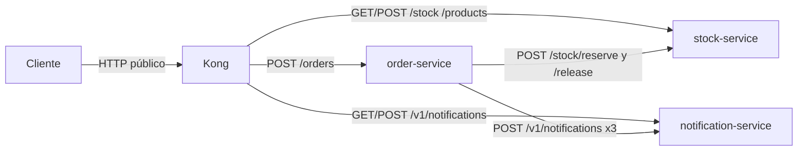
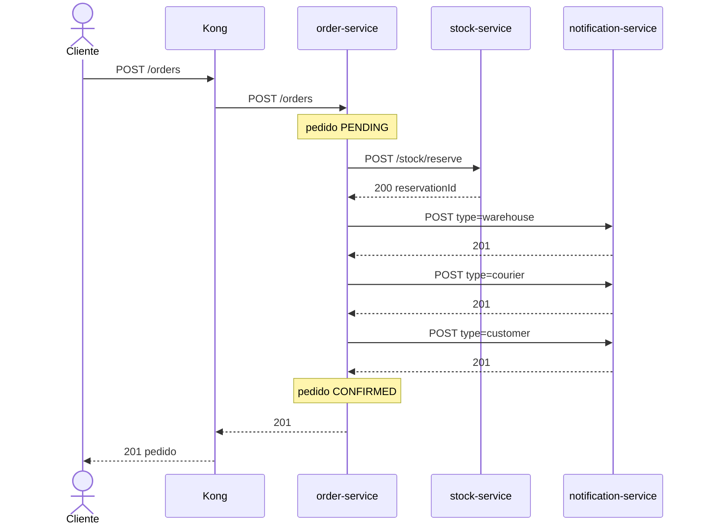
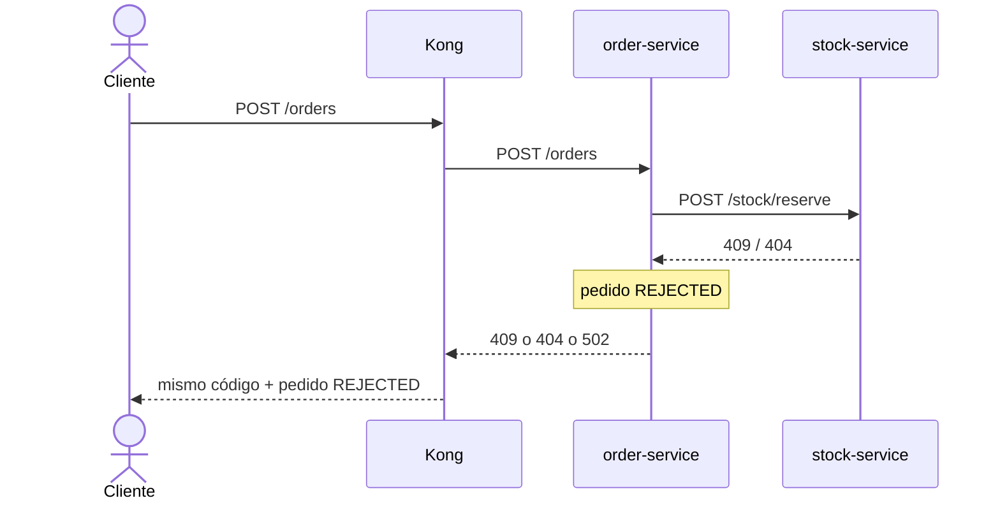
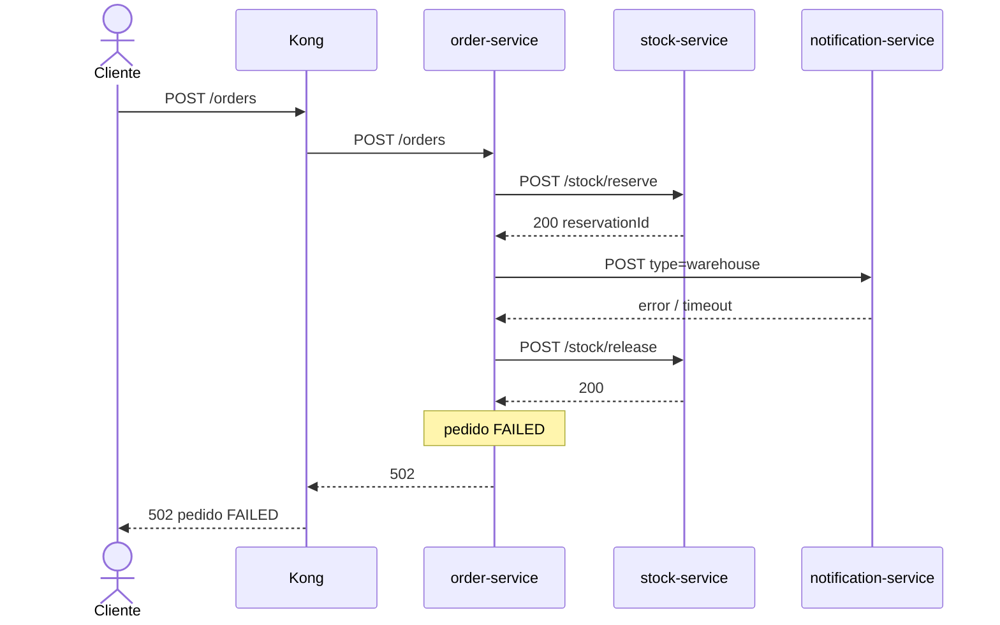

# Demo de microservicios — pipeline de compra
#
# Flujo orquestado por HTTP (sin Kafka):
#   Cliente → Kong (:8000) → order-service (Node)
#                              ├─ stock-service (PHP Slim): reserva de inventario
#                              └─ notification-service (Java): aviso a almacén, mensajero y cliente
#
# Si el stock falla, el pedido queda REJECTED.
# Si las notificaciones fallan después de reservar, se libera el stock (compensación) y el pedido queda FAILED.

## Levantar

```bash
docker compose up --build
```

La primera vez Maven descarga dependencias de Java; puede tardar un par de minutos.

## Puertos

| Qué | URL |
|---|---|
| Kong (entrada de la demo) | http://localhost:8000 |
| Kong Admin | http://localhost:8001 |
| Pedidos (Node) | http://localhost:8080 |
| Stock (PHP) | http://localhost:8081 |
| Notificaciones (Java) | http://localhost:8082 |

Kong reenvía las mismas rutas (`strip_path: false`). Excepción: `GET /health` en `:8000` apunta solo a **order-service**. El health de stock y notificaciones hay que llamarlo en su puerto.

## Grafo de peticiones

Hay dos vistas distintas. La **topología** dice quién puede hablar con quién. La **secuencia** dice el orden real de un `POST /orders`.

El cliente **no** llama a stock ni a notificaciones. Entra solo por Kong (`:8000`). Kong es un proxy: no orquesta el pipeline. **order-service** reserva inventario y dispara los avisos por HTTP interno en la red Docker (`stock-service:8081`, `notification-service:8082`). Esas llamadas internas **no** vuelven a pasar por Kong.

Timeout de las llamadas internas: 5 s. Datos en memoria: al recrear los contenedores se pierde el estado.

### Actores

| Actor | Rol | Puerto |
|---|---|---|
| Cliente | `curl` / app | — |
| Kong | Entrada y proxy | `:8000` (admin `:8001`) |
| order-service | Orquestador (Node) | `:8080` |
| stock-service | Inventario (PHP Slim) | `:8081` |
| notification-service | Avisos (Java) | `:8082` |

### Topología



Kong también expone catálogo y notificaciones para consultas directas (`GET /products`, `GET /v1/notifications`). En el pipeline de compra esas rutas **no** las usa el cliente: las usa order-service contra los puertos internos.

### Camino feliz — `CONFIRMED` (8 saltos, HTTP 201)

Pedido válido con stock. Las tres notificaciones van **en serie** (almacén, mensajero, cliente).



| # | Desde | Hacia | Petición | Resultado | Qué ocurre |
|---|---|---|---|---|---|
| 1 | Cliente | Kong | `POST /orders` | proxy | Cuerpo: `customerId`, `address`, `items`. |
| 2 | Kong | order-service | `POST /orders` | proxy | Reenvío con `strip_path: false`. |
| 3 | order-service | stock-service | `POST /stock/reserve` | 200 | Reserva atómica; devuelve `reservationId`. |
| 4 | order-service | notification-service | `POST /v1/notifications` | 201 | `type=warehouse`; payload: `customerId`, `items`. |
| 5 | order-service | notification-service | `POST /v1/notifications` | 201 | `type=courier`; payload: `address`, `items`. |
| 6 | order-service | notification-service | `POST /v1/notifications` | 201 | `type=customer`; payload: `customerId`, `status: CONFIRMED`. |
| 7 | order-service | Kong | respuesta | 201 | Pedido en memoria con `status: CONFIRMED`. |
| 8 | Kong | Cliente | respuesta | 201 | JSON con `id`, `reservationId` y las tres notificaciones. |

### Sin stock — `REJECTED` (5 saltos, HTTP 409)

Stock insuficiente (`409`), SKU inexistente (`404`) u error al contactar stock (`502`). No hay notificaciones ni `release`. El cliente **nunca** habla con stock-service.



| # | Desde | Hacia | Petición | Resultado | Qué ocurre |
|---|---|---|---|---|---|
| 1 | Cliente | Kong | `POST /orders` | proxy | Igual que el camino feliz. |
| 2 | Kong | order-service | `POST /orders` | proxy | Igual. |
| 3 | order-service | stock-service | `POST /stock/reserve` | 409 (típico) | Inventario insuficiente; no se toca stock. |
| 4 | order-service | Kong | respuesta | 409 / 404 / 502 | Pedido `REJECTED` y `error` de inventario. |
| 5 | Kong | Cliente | respuesta | mismo código | JSON del pedido rechazado. |

Códigos que ve el cliente si falla la reserva: **409** conflicto de stock, **404** SKU no encontrado, **502** si no se puede contactar stock-service.

### Notificación falla — `FAILED` (7 saltos, HTTP 502)

La reserva ya se hizo. Si un aviso falla (timeout, 5xx, `type` inválido), se abortan el resto de notificaciones y se **compensa** con `POST /stock/release`. Saga síncrona: no deja stock huérfano. El inventario vuelve a estar disponible.



El fallo puede ser en warehouse, courier o customer: en cuanto uno falla, no se lanzan los avisos siguientes.

| # | Desde | Hacia | Petición | Resultado | Qué ocurre |
|---|---|---|---|---|---|
| 1 | Cliente | Kong | `POST /orders` | proxy | Igual que el camino feliz. |
| 2 | Kong | order-service | `POST /orders` | proxy | Igual. |
| 3 | order-service | stock-service | `POST /stock/reserve` | 200 | Reserva hecha. |
| 4 | order-service | notification-service | `POST /v1/notifications` | falla | Se corta la serie de avisos. |
| 5 | order-service | stock-service | `POST /stock/release` | 200 | Compensación; si el release falla solo se registra en log. |
| 6 | order-service | Kong | respuesta | 502 | Pedido `FAILED` y `error` de notificación. |
| 7 | Kong | Cliente | respuesta | 502 | JSON del pedido fallido. |

### Estados del pedido

`PENDING` (recién creado) → `CONFIRMED` (camino feliz), `REJECTED` (reserva fallida) o `FAILED` (notificación fallida + release).

Validación local **antes** de llamar a nadie: si faltan `customerId`, `address` o `items`, order-service responde **400** `INVALID_ORDER` y no hay grafo aguas abajo.

## Endpoints

### order-service (Node) — `:8080`

Orquesta el pedido: reserva stock y dispara las notificaciones.

| Método | Ruta | Descripción |
|---|---|---|
| `GET` | `/health` | Estado del servicio |
| `GET` | `/orders` | Lista todos los pedidos |
| `GET` | `/orders/:id` | Detalle de un pedido. `404` si no existe |
| `POST` | `/orders` | Crea un pedido y lanza el pipeline |

Cuerpo de `POST /orders`:

```json
{
  "customerId": "cust-1",
  "address": "Calle Demo 1, Madrid",
  "items": [{ "sku": "SKU-TSHIRT", "qty": 2 }]
}
```

Estados del pedido: `PENDING` → `CONFIRMED` (ok), `REJECTED` (sin stock) o `FAILED` (notificación fallida; se libera el stock).

### stock-service (PHP Slim) — `:8081`

Inventario en memoria (JSON en el contenedor). Reserva atómica: o se descuenta todo, o no se toca nada.

| Método | Ruta | Descripción |
|---|---|---|
| `GET` | `/health` | Estado del servicio (no pasa por Kong) |
| `GET` | `/products` | Catálogo con stock actual |
| `POST` | `/stock/reserve` | Reserva unidades para un `orderId` |
| `POST` | `/stock/release` | Devuelve el stock de una reserva (compensación) |

Cuerpo de `POST /stock/reserve`:

```json
{
  "orderId": "ord-1",
  "items": [{ "sku": "SKU-TSHIRT", "qty": 2 }]
}
```

Cuerpo de `POST /stock/release`:

```json
{ "orderId": "ord-1" }
```

Errores habituales: `400` ítems inválidos, `404` SKU o reserva inexistente, `409` stock insuficiente. Reservar dos veces el mismo `orderId` es idempotente.

### notification-service (Java) — `:8082`

Avisos a almacén, mensajero y cliente. `type` admitidos: `warehouse`, `courier`, `customer`.

| Método | Ruta | Descripción |
|---|---|---|
| `GET` | `/v1/notifications/health` | Estado del servicio |
| `GET` | `/v1/notifications` | Lista notificaciones. Query opcional: `?orderId=` |
| `POST` | `/v1/notifications` | Crea una notificación (`201`) |

Cuerpo de `POST /v1/notifications`:

```json
{
  "type": "warehouse",
  "orderId": "ord-1",
  "payload": { "items": [{ "sku": "SKU-TSHIRT", "qty": 2 }] }
}
```

Errores habituales: `400` si faltan `type`/`orderId` o si `type` no es uno de los tres permitidos.

## Pedido de ejemplo

```bash
curl -s -X POST http://localhost:8000/orders \
  -H 'Content-Type: application/json' \
  -d '{
    "customerId": "cust-1",
    "address": "Calle Demo 1, Madrid",
    "items": [
      { "sku": "SKU-TSHIRT", "qty": 2 },
      { "sku": "SKU-MUG", "qty": 1 }
    ]
  }'
```

Stock insuficiente (el pedido se rechaza y no se notifica):

```bash
curl -s -X POST http://localhost:8000/orders \
  -H 'Content-Type: application/json' \
  -d '{
    "customerId": "cust-1",
    "address": "Calle Demo 1, Madrid",
    "items": [{ "sku": "SKU-CAP", "qty": 999 }]
  }'
```

## Consultas

```bash
# Catálogo e inventario
curl -s http://localhost:8000/products

# Pedidos
curl -s http://localhost:8000/orders

# Notificaciones de un pedido
curl -s "http://localhost:8000/v1/notifications?orderId=<ID_DEL_PEDIDO>"
```

## Catálogo inicial

| SKU | Producto | Stock |
|---|---|---|
| SKU-TSHIRT | Camiseta | 20 |
| SKU-MUG | Taza | 15 |
| SKU-HOODIE | Sudadera | 8 |
| SKU-CAP | Gorra | 5 |

Los datos viven en memoria: al recrear los contenedores el stock vuelve al valor inicial.
